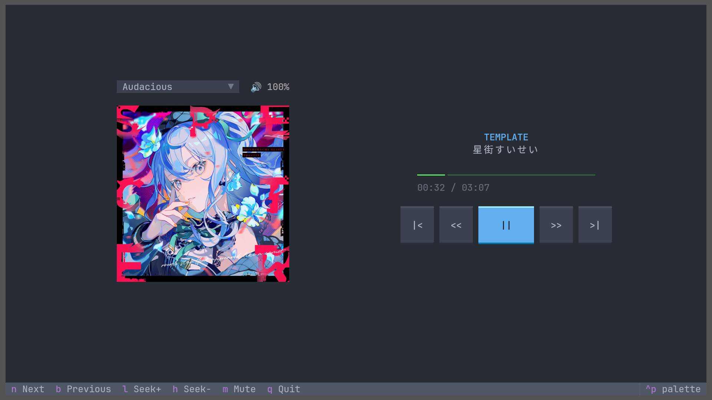

# mdct
A Textual-TUI-based Media Control with integration of MPRIS, used in terminals such as Kitty and KDE Konsole.




## Overview
mdct is based on Python with the Textual TUI API to synchronize song metadata from music players (such as YouTube Music, Spotify, VLC, etc.) with MPRIS dbus integration in Linux.

## Features
- Runs on terminal: Can run anywhere, as long as it has a terminal (e.g., Visual Studio Code, PyCharm, Zed, Dolphin, etc.)
- Real-time sync: Sync metadata such as artist, song title, album art, and progress bar.
- Album art: Gives rendered album art with PIL and KGP/Sixel protocols. (Requires a terminal that supports one of the two protocols, such as Kitty or Konsole.)
- Lightweight: Uses fewer resources than Electron UI.
- Interactive buttons: Play, seek, skip, and previous buttons to give commands to the music player.

## Requirements
- Linux distro with dbus & MPRIS support (a mainstream desktop distro should work).
- Python 3.10 or later with python3-dbus.
- Terminal with mouse click support.
- Terminal with KGP/Sixel protocol if you want the `--full` or `--wide` interface with album art.

## Installation

Run this command:

```bash
chmod +x install.sh
./install.sh
```

After the installation completes, run this command:

```bash
mdct -v
```

## Usage

Run this command:

```bash
mdct
```

### Flags
| Flags |           | Order                                              |
| ----- | --------- | -------------------------------------------------- |
| -f    | --full    | show full-screen vertical layout with album art    |
| -w    | --wide    | show side-by-side horizontal layout with album art |
| -v    | --version | output version information                         |
| -h    | --help    | display this help and exit                         |

> Note: You need a terminal with TGP (Terminal Graphics Protocol) for Kitty/Sixel protocol support to make album art visible, Kitty TGP protocol is recommended (kitty). For more information, please check https://github.com/lnqs/textual-image and [Terminal Support](docs/terminal_support.md)

## Keybindings

| Key     | Function          |
| ------- | ----------------- |
| SPACE   | Play/pause toggle |
| n       | Next song         |
| b       | Previous song     |
| h       | Seek prev 10 secs |
| l       | Seek next 10 secs |
| q       | Quit application  |
| SHIFT+p | Textual menu      |

--- 
Made by curious by **NISY**
