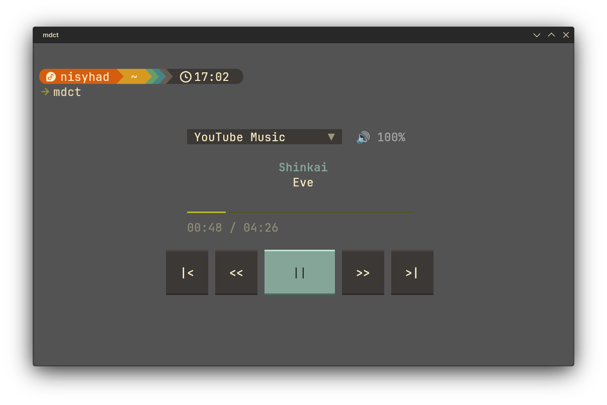
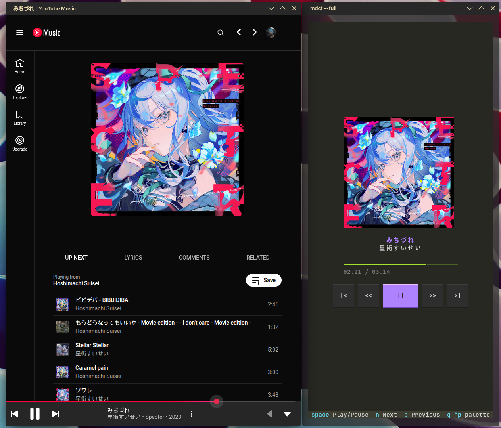

# mediacontrol-tui
A Textual-TUI-based Media Control with integration of MPRIS. Used in Terminal such as Kitty, KDE Konsole.





## Overview 
This project is based from Python with Textual TUI API to synchronize song metadatas from music player (such as: YouTube Music, Spotify, VLC, etc.) with integration of MPRIS dbus in Linux.

## Features
- Real-time sync: Sync metadatas such as artist, song title, album art, progress bar.
- Album art: Gives rendered album art with PIL and TGP/Sixel protocols. (needs Terminal which supported one of both protocols, like Kitty, Konsole).
- Lightweight: Use fewer resources than Electron UI.
- Interactive buttons: Play, seek, skip, and prev buttons to gave command to music player.

## Installation

Run this command:

```bash
chmod +x install.sh
./install.sh
```

After the installation completed, run this command:

```bash
mdct
```

If you want with album art image content, run this command:

```bash
mdct -f
```
