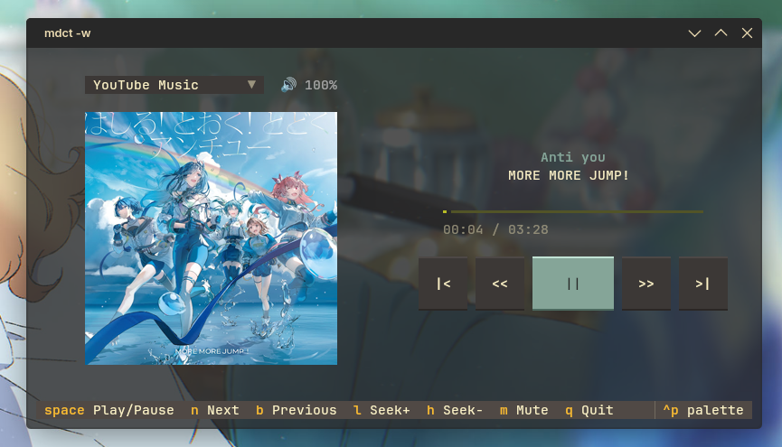
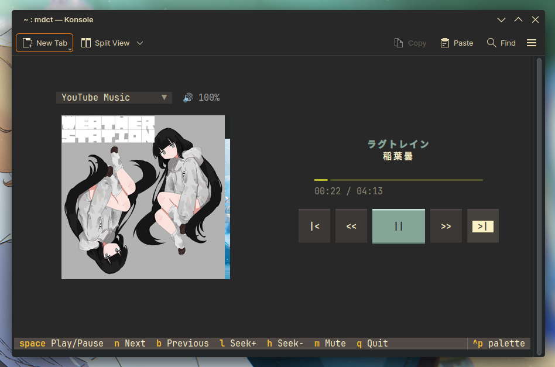
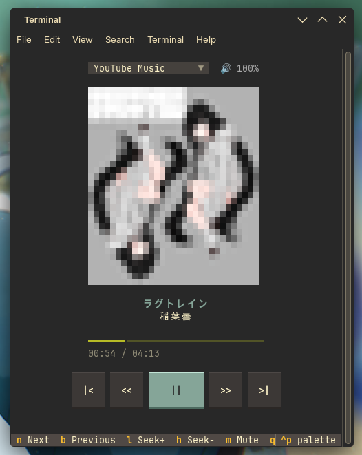

Date Written: 29 August 2026, Date Updated: 29 August 2029

# mdct Terminal Support
## Brief

Terminal support in mdct, especially for PIL Image, is not widely supported. Most terminals have issues displaying images. For now, I recommend [kitty](https://sw.kovidgoyal.net/kitty/) with [Nerd Fonts](https://www.nerdfonts.com/).

---

## 🥇 Gold
### kitty

Kitty has a built-in TGP that can display images from PIL very well, without any noticeable glitches even when the terminal window size and text size change. Additionally, kitty can make Textual themes transparent if the background palette color of Textual matches kitty's, as long as the window opacity configuration is in the range 0.8–0.99 in kitty.conf.
## 🥈 Silver
### KDE Konsole

KDE Konsole supports Sixel natively, which can display images from PIL quite well, but there are noticeable glitches when the terminal window size and text size change.
### Dolphin and Kate
Because the terminal in Dolphin and Kate is based on KDE Konsole, they have the same characteristics as KDE Konsole (e.g., can display PIL Images with noticeable glitches).
## ❌ Borked for PIL Image
### GNOME Terminal

Image result is pixelated and blurry; mouse and keybinding support work.
### Xterm
Image result is pixelated and blurry; mouse and keybinding support work.
### Visual Studio Code
Image result is pixelated and blurry; SHIFT keybindings do not work well; mouse support works.
### Zed
Image result is pixelated and blurry; SHIFT keybindings do not work well; mouse support works.
## ❌ Borked for mouse
### PyCharm
Image result is pixelated and blurry; SHIFT keybindings do not work well; mouse support is not available.

## 🔠 Font Support
Because mdct includes emoji, Nerd Fonts are recommended.
Fonts like JetBrains Mono have text symbols that can be an alternative.

## Updated Notes
I am working on terminal module support in TUI applications like vim, lazygit, etc. The process is still WIP.
